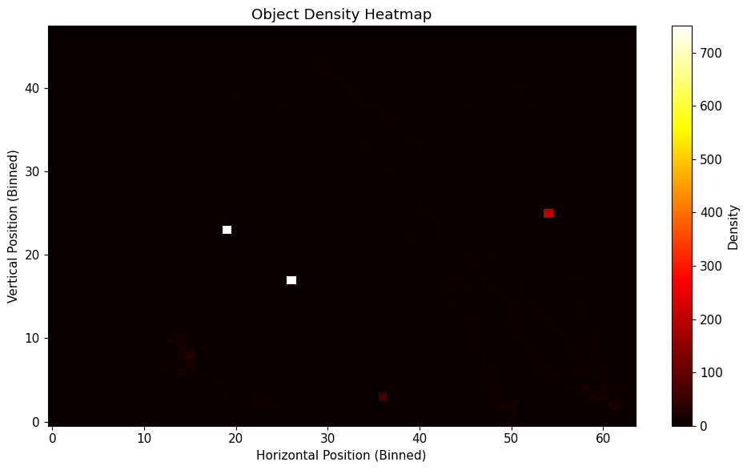
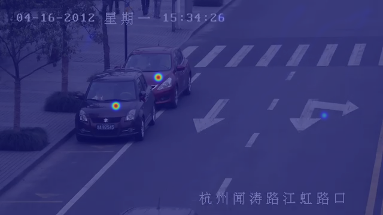

# Smart Traffic Analyzer with YOLOv5

This project demonstrates object detection on traffic video footage using the YOLOv5 deep learning model. The system processes a video file frame-by-frame, identifies objects such as cars and pedestrians, and outputs an annotated video with bounding boxes and class labels.

## Features
- 🔍 Real-time object detection and object tracking with YOLOv8
- ⚡ ByteTrack tracker integration for consistent object IDs across frames
- 📦 Outputs annotated `.mp4` video with bounding boxes and tracked IDs

## Technologies Used
- Python
- Ultralytics YOLOv8
- ByteTrack (via built-in tracker)
- Google Colab

## How It Works
1. Upload a short `.mp4` traffic video to Colab.
2. YOLOv8 detects objects and applies ByteTrack tracking.
3. An annotated output video is saved automatically with bounding boxes and object IDs.
4. The output can be previewed inline or downloaded.

## Sample Outputs

<table>
  <tr>
    <td><strong>Input Video</strong></td>
    <td><strong>YOLOv5 Detection</strong></td>
    <td><strong>YOLOv8 + ByteTrack</strong></td>
  </tr>
  <tr>
    <td></td>
    <td></td>
    <td></td>
  </tr>
</table>

- The YOLOv5 output shows raw object detection with bounding boxes and class labels only.
- The YOLOv8 + ByteTrack output builds on that by adding real-time object tracking, assigning consistent IDs to moving vehicles across frames.

---
## Heatmap Visualizations

<table>
  <tr>
    <td><strong>Object Density Heatmap</strong></td>
    <td><strong>Heatmap Overlay on Video Frame</strong></td>
  </tr>
  <tr>
    <td></td>
    <td></td>
  </tr>
</table>

- The object density heatmap shows where detections were concentrated over the entire video.
- The frame overlay shows these high-traffic areas blended onto a sample frame, highlighting zones of activity.

<table>
  <tr>
    <td><strong>Heatmap Overlay on Every Video Frame</strong></td>
    <td><strong>Side By Side Comparison</strong></td>
  </tr>
  <tr>
    <td></td>
    <td></td>
  </tr>
</table>

---
---

### 🚀 Run It in Colab

---

### Author
Built by Jalen Gilbert as a demonstration of fundamental computer vision techniques using modern deep learning libraries.